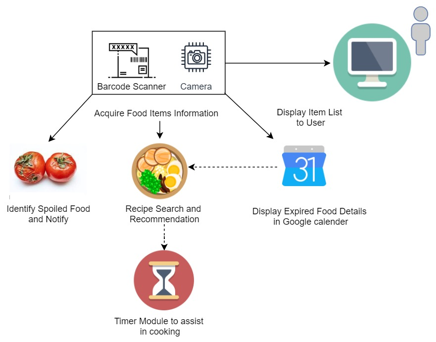

# Refrigerator-Management

### 2021 SUMMER LGSI-CU-KNU-JNU INTERNSHIP  

### JNU TEAM NO.1

---

## Commit Members

- [Sunkou Kim](https://github.com/ksg0605) : Team Leader
- [Ga-young Kim](https://github.com/chavi55)
- [Subin Hyun](https://github.com/Subinhyun)
- [Younwoo Roh](https://github.com/RohYounwoo)
- [Yujin Kim](https://github.com/yujin2019)

---

## Architecture

---

## Functions

- Register the expiration by scanning the barcode
- Sort list in descending order and alert
- Recipe recommendationa based on the list
- Cooking timer function
- Seasonal food recommendations
- Recognizing the spoiled state of food as an image

---

## webOS Components

- Front-End : Enact, React
- Back-End : nodeJS
- webapp for webOS
- Luna Bus : camera2, db8
- barcode api, google calendar api, quagga api

---
